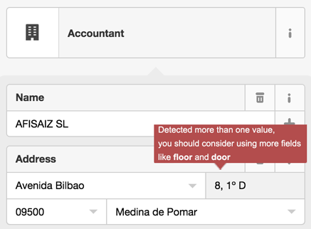

# OpenStreetMap Data Wrangling with MongoDB

## 1. Introduction

The goal of this project is to choose any area of the world in [https://www.openstreetmap.org](https://www.openstreetmap.org/) and use data munging techniques, such as assessing the quality of the data for validity, accuracy, completeness, consistency and uniformity, to clean the *OpenStreetMap* data for a part of the world, converting it from XML to JSON format, importing the clean file into a *MongoDB* database and run some queries against it.

To obtain the data I have made a query to `http://overpass-api.de/query_form.html` after searching for [*Las Merindades*](https://www.openstreetmap.org/relation/4718122#map=10/42.9408/-3.4854), which is the region where my hometown, [*Medina de Pomar*](https://en.wikipedia.org/wiki/Medina_de_Pomar), belongs to. The query is the following:

``` 
(node(42.5966, -4.2339, 43.2832, -2.7370);<;);out meta;
```

And the resulting `osm` (or `xml`) data is stored on `/data/file.osm`, which is a *355,3 MB* file (that can be downloaded also [here](https://www.dropbox.com/s/9d8io7q19lkq2b1/merindades.osm?dl=0)). A *sample* of that file (created with the [sample.py](./src/sample.py) script) can be accessed [here](./data/sample.osm).

## 2. Problems Encountered in the Map

I assume that **all the attributes, except for the *tags*, are correct**. That is, the *common attributes*, the GPS positions for the *nodes* and the list of nodes for the *ways* were not sanity checked. Each *tag* has a *key/value pair* referring a specific characteristic of that *node* or *way*. I am going to audit first the *keys*, and then I will continue with the *values*.

### 2.1 Keys

> This analysis has been performed with different functions within scripts: [audit_keys_basic.py](./src/audit_keys_basic.py), [audit_keys_namespaces.py](./src/audit_keys_namespaces.py).

To audit the *keys* I have checked their structure applying *regular expressions*. By this way I have identified those *keys* that are different to others in some way: *keys* with [namespaces](http://wiki.openstreetmap.org/wiki/Namespace) and *keys* with caps letters. I also looked for problematic characters (other than `a-z` or `_`).

- Problematic characters: 1 encountered.
  
  -  `<tag k="Torreón del castillo de los Salazar" v="water" />` should be `<tag k="name" v="Torreón del castillo de los Salazar" />`
  
- Caps chars: several matches but only one "real" error (view [full analysis](./README.md) for further description): 
  
  - `<tag k="N" v="Calle Real" />` should be `<tag k="name" v="Calle Real" />`
  
- Namespaces: several cases where there are both namespaces and not namespaces for a specific *key*. For example, in **population** it is possible to have both **key=population** and **key=population:date**. The OSM standard allows this kind of naming, but if I want the attributes with namespaces nested within their *parent* (or *prefix*) then I have to create a *default* namespace for cases like this, having a **key=population:default** and a **key=population:date**. By this way the resulting JSON document will be:
  
- ``` json
  {...
  'population': {
  	'default': population_value,
      'date': population_date
  }}
  ```

### 2.2 Values

> This analysis has been performed with different functions within the [audit_values_basic.py](./src/audit_values_basic.py) script.

Given the large amount of different attributes, I have focused in those that could be checked in some way, like the [address](http://wiki.openstreetmap.org/wiki/Key:addr) fields.

Attending the **housenumber** values, there are different patterns: with only numbers, with numbers and a capital letter, with a number and a word *bis* (which means that there are two buildings with the same number; it appears close to the number, separated by a space, with capital and non capital letters), with a range of numbers (as a list and also as an interval) and others:

``` json
['SN(B)', 'SN(D)', '7 - 43', '2 - 36', '46, BIS', '2, 4 y 7', u'8, 1\xba D', '2, 4', '6, 8', '12, 14', '13-15', 'SN(A)', '15-17', '2019.', '1-3', 'SN(C)', 'SN(E)', '4, 6', 'km 508', '4, 6, 8, 10', 's/n', '3, 5, 7, 9', '12-14', '8, 10', '37-39', '12-38']
```

For those that have several values the best approach would be to save the values within an array, but I do not know if a range `12-14` includes the number 13 or not (probably not, at least in Spain). I have also values with `s/n` which means *sin número* (*without number* in spanish). I suppose the `SN(...)` values refer the same as `s/n` but with a letter instead of a number. However, I had some values that could be corrected (like `46, BIS` to `46 BIS` or `8, 1º D` to `8`).

Analyzing the **housename**, I saw one numeric value `1` that should not be there and three street names that probably should not be there either. In the case of **city**, we had one case that starts with lowercase and should be corrected.

I centered my efforts analyzing the **street** value, looking mainly for unexpected street types or abbreviations and creating a *mapping* function to correct those values. There were not so many abbreviations, most of the time I had to change the street type from *all-capital-letter* to a *sentence-like* form. I also fixed some abbreviations like `C/` and `CL` for `Calle`, `Bº` for `Barrio` or `CR` and `CRTA.` for `Carretera`. 

By this analysis I detected a lot of cases where the values were not where they should be (like the **housenumber** inside the **housename**). I also had other cases where the use of the field was misunderstood, like the case we had a **housenumber** of `8, 1º D`, where `8` is indeed the number of the house but the other data should be placed into the **floor** and **door** fields. Furthermore, I had only detected theses cases because I was looking for wrong *street-type* names, but I am sure that there are plenty of them along the document (and a more in-depth analysis should be done to reach them).

## 3. Data Overview

### 3.1 Documents

As we have seen before, we have the original OSM xml document and a cleaned version in JSON format. These documents have the following approximate size:

``` 
data.osm .......... 355 MB
cleaned.jsonl ..... 430 MB
```

### 3.2 Database

#### 3.2.1 General Overview

Now that I have collected the data within a MongoDB database is time to run some queries to extract some insights about the OSM data. We are going to use the [*mongo* shell](http://docs.mongodb.org/v2.2/mongo/), an interactive JavaScript shell.

- Total number of *Elements*:

``` javascript
> db.merindades.find().count()
1855383
```

- Total number of *Nodes*:

``` javascript
> db.merindades.find({'type': 'node'}).count()
1758132
```

- Total number of *Elements* that have a *null* value inside the **visible** attribute:

``` javascript
> db.merindades.aggregate([{'$group': {'_id': '$visible', 'count': {'$sum': 1}}}])
{ "_id" : null, "count" : 1855383 }
```

In the [clean.py](./src/clean.py) script I created an attribute *visible* for those cases where it would not exist, associating a *null* value (instead of a *true* or *false*). As we can see here, there is not any *Element* that has a *visible* attribute in the original OSM file, so all the documents in the database have a *null* value within the *visible* attribute.

- Number of **places** aggregated by type:

``` javascript
> db.merindades.aggregate([{'$match': {'place': {'$exists': 1}}}, {'$group': {'_id': '$place', 'count': {'$sum': 1}}}, {'$sort': {'count': -1}}])
{ "_id" : "locality", "count" : 12872 }
{ "_id" : "hamlet", "count" : 1076 }
{ "_id" : "village", "count" : 654 }
{ "_id" : "neighbourhood", "count" : 206 }
{ "_id" : "isolated_dwelling", "count" : 83 }
{ "_id" : "suburb", "count" : 75 }
{ "_id" : "farm", "count" : 8 }
{ "_id" : "town", "count" : 8 }
{ "_id" : "yes", "count" : 3 }
{ "_id" : "La Coteruca", "count" : 1 }
{ "_id" : "state", "count" : 1 }
{ "_id" : "city", "count" : 1 }
```

Here there are some values that should probably not be there, like **yes** or **La Coretuca**. I should have audit these error in previous stages of the process or update the documents in the database.

- Number of unique users:

``` javascript
> db.merindades.distinct('created.user').length
553
```

- Top 5 users by contributions:

``` javascript
> db.merindades.aggregate([{'$group': {'_id': '$created.user', 'count': {'$sum': 1}}}, {'$sort': {'count': -1}}, {'$limit': 5}])
{ "_id" : "cronoser", "count" : 415038 }
{ "_id" : "Emilio Gomez", "count" : 280561 }
{ "_id" : "sanchi", "count" : 170710 }
{ "_id" : "jonbergor", "count" : 123627 }
{ "_id" : "www_dorono_tk", "count" : 65890 }
```

As I was expecting here, the contributions are highly skewed, the contribution percentage of these 5 is: *cronoser* 22.37%, *Emilio Gomez* 15.12%, *sanchi* 9.2%, *jonbergor* 6.67% and *www_dorono_tk* 3.55%. Moreover, these 5 users, that represent the **0.9% of the total users, have edited 56.91%** of the *Elements*.

- Top 10 users by contribution:

``` javascript
> db.merindades.aggregate([{'$group': {'_id': '$created.user', 'count': {'$sum': 1}}}, {'$sort': {'count': -1}}, {'$limit': 10}, {'$group': {'_id': 'top_10_users', 'count': {'$sum': '$count'}}}])
{ "_id" : "top_10_users", "count" : 1304382 }
```

Here we can see that the top 10 users by contribution have edited the 70.3% of the *Elements* in our database. That is, **1.8% of the total users have edited 70.3%** of the *Elements*.

- Percentage of the *Elements* mapped by the top 5% users by contribution:

``` javascript
> db.merindades.aggregate([{'$group': {'_id': '$created.user', 'count': {'$sum': 1}}}, {'$sort': {'count': -1}}, {'$limit': 27}, {'$group': {'_id': 'top_10_users', 'count': {'$sum': '$count'}}}])
{ "_id" : "top_10_users", "count" : 1660270 }
```

The **89.48% of the *Elements* have been mapped by the 5% of the users**.

- Top 10 types of **amenities**:

``` javascript
> db.merindades.aggregate([{'$match': {'amenity': {'$exists': 1}}}, {'$group': {'_id': '$amenity', 'count': {'$sum': 1}}}, {'$sort': {'count': -1}}, {'$limit': 10}])

{ "_id" : "place_of_worship", "count" : 1052 }
{ "_id" : "drinking_water", "count" : 868 }
{ "_id" : "parking", "count" : 526 }
{ "_id" : "bar", "count" : 336 }
{ "_id" : "restaurant", "count" : 273 }
{ "_id" : "bank", "count" : 210 }
{ "_id" : "school", "count" : 209 }
{ "_id" : "cafe", "count" : 140 }
{ "_id" : "pharmacy", "count" : 124 }
{ "_id" : "fuel", "count" : 122 }
```

No surprise here, due to the fact that there is a church in almost every single village in Spain, no matter the size of it.

- Grouping the *places of worship* by **religion**:

``` javascript
> db.merindades.aggregate([{'$match': {'amenity': {'$exists': 1}, 'amenity': 'place_of_worship'}}, {'$group': {'_id': '$religion', 'count': {'$sum': 1}}}, {'$sort': {'count': -1}}, {'$limit': 5}])
{ "_id" : "christian", "count" : 1035 }
{ "_id" : null, "count" : 16 }
{ "_id" : "muslim", "count" : 1 }
```

Also it would be likely that those that have no **religion** attribute (that appear as *null*) are also referring to *christian* religion.

#### 6.2.2 Geospational Queries

I have added a position attribute to the *Nodes* that allows to query in terms of distance to a desired point, I only need to create a [geospatial index](http://docs.mongodb.org/manual/applications/geospatial-indexes/) first. Here I can use the [$near](http://docs.mongodb.org/manual/reference/operator/query/near/) operator, that returns the documents from nearest to farthest. Because I am specifying a [2d index](http://docs.mongodb.org/manual/core/2d/) with the *longitude* and *latitude* in the **pos** attribute in degrees, I need to specify the distance in the same units. Then, if I want to query within a distance in kilometers, I have to convert it by the following equation:

``` 
distance [º] = (distance [km] / earth_radius [km] ) * ( 180 º / π rad ) 
```

with and earth radius of 6378.1 km

Here I am going to take the location reference of my hometown, *Medina de Pomar*, which is `[ -3.4861165, 42.9322093 ]`.

- Number of *Elements* within a distance of **5 km**:

``` javascript
> db.merindades.find({'pos': {'$near': [ -3.4861165, 42.9322093 ], '$maxDistance': (5 * (180/(Math.PI * 6378.1)))}}).count()
50047
```

- Number of *Amenities* within a distance of **5 km**:

``` javascript
> db.merindades.find({'pos': {'$near': [ -3.4861165, 42.9322093 ], '$maxDistance': (5 * (180/(Math.PI * 6378.1)))}, 'amenity': {'$exists': 1}}).count()
143
```

- Number of *bars*, *cafes* and *restaurants* within a distance of **5 km**.

``` javascript
> db.merindades.find({'pos': {'$near': [ -3.4861165, 42.9322093 ], '$maxDistance': (5 * (180/(Math.PI * 6378.1)))}, 'amenity': {'$in': ['bar', 'cafe', 'restaurant']}}).count()
53
```

I was always impressed by the amount of this kind of places in my hometown, considering that it has an approximate population of 6.000 habitants.

- Number of *schools*, *places of worship*, *pharmacies*, *banks* and *fuel stations* within a distance of **5 km**:

``` javascript
> db.merindades.find({'pos': {'$near': [ -3.4861165, 42.9322093 ], '$maxDistance': (5 * (180/(Math.PI * 6378.1)))}, 'amenity': 'school'}).count()
1

> db.merindades.find({'pos': {'$near': [ -3.4861165, 42.9322093 ], '$maxDistance': (5 * (180/(Math.PI * 6378.1)))}, 'amenity': 'place_of_worship'}).count()
1

> db.merindades.find({'pos': {'$near': [ -3.4861165, 42.9322093 ], '$maxDistance': (5 * (180/(Math.PI * 6378.1)))}, 'amenity': 'bank'}).count()
6

> db.merindades.find({'pos': {'$near': [ -3.4861165, 42.9322093 ], '$maxDistance': (5 * (180/(Math.PI * 6378.1)))}, 'amenity': 'pharmacy'}).count()
4

> db.merindades.find({'pos': {'$near': [ -3.4861165, 42.9322093 ], '$maxDistance': (5 * (180/(Math.PI * 6378.1)))}, 'amenity': 'fuel'}).count()
2
```

- Number of *places of worships* and *bars, cafes and restaurants* within a distance of **25 km**:

``` javascript
> db.merindades.find({'pos': {'$near': [ -3.4861165, 42.9322093 ], '$minDistance': 0, '$maxDistance': (25 * (180/(Math.PI * 6578.1)))}, 'amenity': 'place_of_worship'}).count()  
21

> db.merindades.find({'pos': {'$near': [ -3.4861165, 42.9322093 ], '$minDistance': 0, '$maxDistance': (25 * (180/(Math.PI * 6578.1)))}, 'amenity': {'$in': ['bar', 'cafe', 'restaurant']}}).count()
155
```

Increasing the distance from the center of the town, I can reach other small villages where each one of them would probably have its own church and probably several *bars* (at least in the bigger ones).

## 4. Additional Ideas

Given the results of the analysis, I think the most problematic errors are due to the fact the the attributes are too much free. Here I am not only referring to the fact that *both the key and value are free format text fields* (as the [OSM wiki](http://wiki.openstreetmap.org/wiki/Tags) specifies), but also to the freedom that a common user has when adding or modifying a value. 

In my opinion it could be a good idea to add some kind of *field verification* within the different *most-used* *tags*. I know it could be complex to put in practice because of the different conventions for different countries, but this *freedom* is a continuous source of errors. 

For example there could be a *verification* process while the user is introducing a new **street**, so that he would not be allowed to enter a full address. Instead of allowing that behavior, the application could show the user an *error hint* similar to this:



Another option could be to create a directory with *Elements* that are likely to be wrong, where users could access them directly (without analyzing the overall data) and correct them there. This directory could be created directly by the users, identifying errors manually. Once that database grows up, it could be a good idea to develop a *Machine Learning* system that learns from that data and create *patterns* to identify wrong *Elements* so that it will not be necessary to continue identifying those wrong values manually.

By this way there would be an automatic system that identifies possible wrong values and asks *expert* users to verify those values, creating a more reliable source of data.

## 5. Conclusion

Through all the stages of this project I have seen that there are a wide variety or errors within the OSM data. I have centered the effort in analyzing only some of the fields, but **there is definitely more work to do if we want a completely cleaned data**. I have found errors in both *keys* and *values* of the different *tags*, and I have not only corrected them but also fixed some issues with the data, like creating various fields from one originally wrong (in case of *streets* that included also the number of the house and even the door letter). 

Despite the effort, the huge amount of different kind of *tags* make the cleaning process almost impossible if the efforts are not centered in the fields that the interest in analyzing yields (like in this case the *address*). 

The OSM edition process is too much open to interpretations and in some cases it is not clear what rule to apply while tagging an item. It seems that it is too complex to know all the procedures to apply or they are too complex for an average user to spent time reading the documentation before start editing (what leads in errors about *what-each-tag-means*).

I also find particularly tricky to work with the absolutely freedom allowed while adding new tags. I think that a more-structured approach could benefit the overall experience while working with OSM data.

Apart from that, I think is incredible the power that a community could have while creating things together. Open Street Maps is without any doubt a great source of information and also it is probably the most recently actualized data (which depends on the activity of their users of course). 